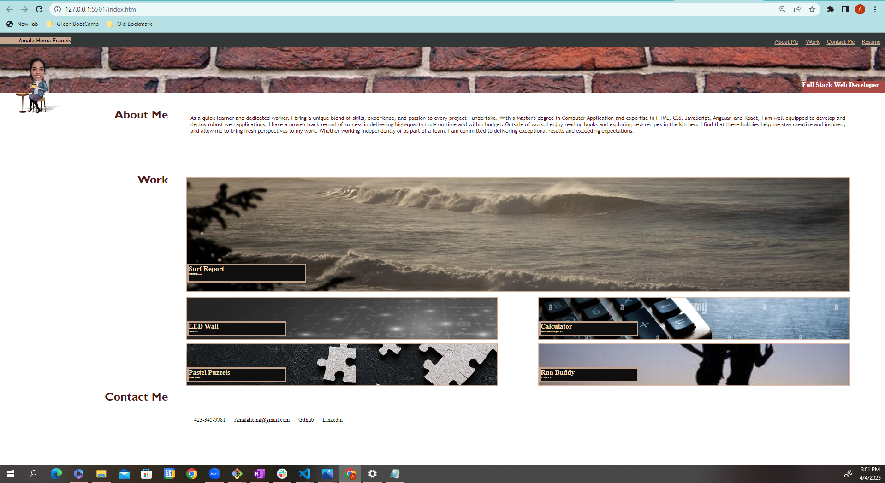

# Design Your Portfolio 
## Table of Contents
- Overview
    - The Challenge
    - Screenshot
    - Links
- My Approach
    - Code construction
    - Learnings
- Author

## Overview

### The Challenge
- User should be able to build a website from scratch , Below are the challenge request
- AS AN employer
I WANT to view a potential employee's deployed portfolio of work samples
SO THAT I can review samples of their work and assess whether they're a good candidate for an open position

- GIVEN I need to sample a potential employee's previous work
- WHEN I load their portfolio
- THEN I am presented with the developer's name, a recent photo or avatar, and links to sections about them, their work, and how to contact them
- WHEN I click one of the links in the navigation
- THEN the UI scrolls to the corresponding section
- WHEN I click on the link to the section about their work
- THEN the UI scrolls to a section with titled images of the developer's applications
- WHEN I am presented with the developer's first application
- THEN that application's image should be larger in size than the others
- WHEN I click on the images of the applications
- THEN I am taken to that deployed application
- WHEN I resize the page or view the site on various screens and devices
- THEN I am presented with a responsive layout that adapts to my viewport

### Screenshot

### Links

- GitHub URL - https://github.com/amalahema/02_challenge

## My Approach

### Code construction

- Semantic HTML
- CSS

### Learnings

   - Design a portfolio web page including Nav Bar and its link.
   - Add Profile Name , picture and it's placements.
   - Move to corresponding section when the user click the Nav link.
   - Construct the aside and Article content.
   - Application's image becomes larger in size than the others while hovering.
   - Use class to reduce or merge duplicates in CSS
   - Learned to insert / display the contact links in footer.

   # Author

   - Amala Hema , https://github.com/amalahema
